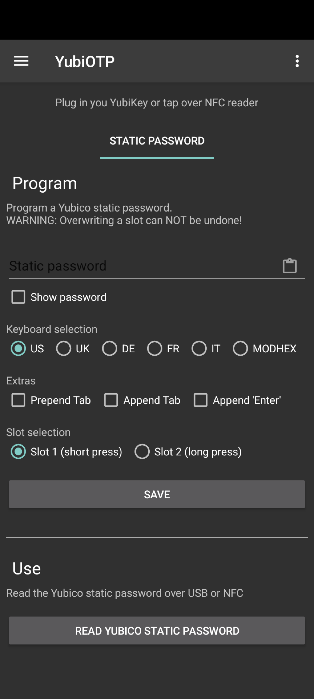
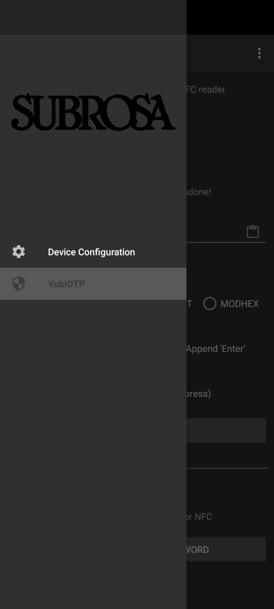
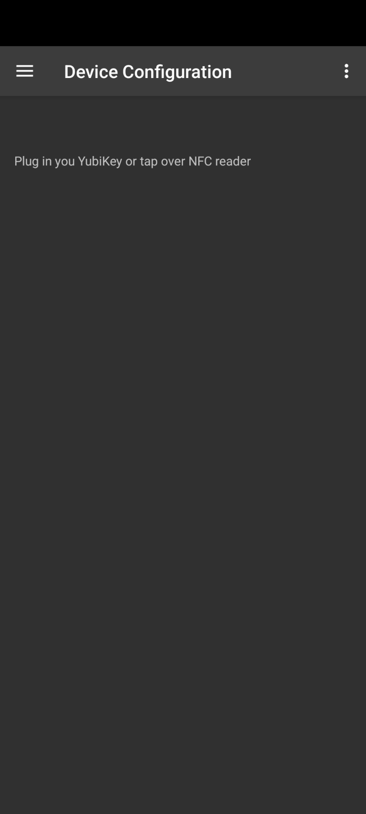
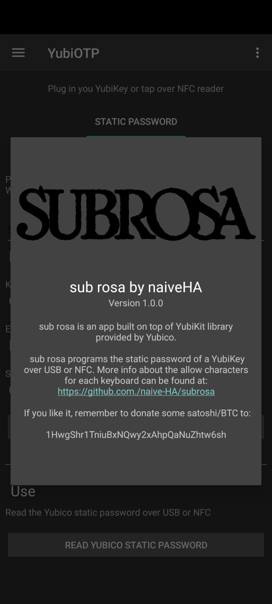

== sub rosa by naiveHA
*sub rosa* is an Android app built on top of YubiKit library provided by Yubico

*sub rosa* programs the static password of a YubiKey over USB or NFC.

*Keyboards*

The various keyboards accept the following characters:

*US*: space, \n, \t and abcdefghijklmnopqrstuvwxyzABCDEFGHIJKLMNOPQRSTUVWXYZ0123456789!"#$%&'`()*+-=,./:;<>?@[\]^_{}|~

*UK*: space, \n, \t and abcdefghijklmnopqrstuvwxyzABCDEFGHIJKLMNOPQRSTUVWXYZ0123456789!@£$%&'`()*+-=,./:;<>?"[#]^_{}~¬

*DE*: space, \n, \t and abcdefghijklmnopqrstuvwxyzABCDEFGHIJKLMNOPQRSTUVWXYZ0123456789!"#$%&'()*+-=,./:;<>?^_`§´ÄÖÜßäöü

*FR*: space, \n, \t and abcdefghijklmnopqrstuvwxyzABCDEFGHIJKLMNOPQRSTUVWXYZ0123456789!"$%&'()*+-=,./:;<_£§°²µàçèéù

*IT*: space, \n, \t and abcdefghijklmnopqrstuvwxyzABCDEFGHIJKLMNOPQRSTUVWXYZ0123456789!"#$%&'()*+,-./:;<=>?@\^_`|£§°çèéàìòù

*MODHEX*: bcdefghijklnrtuvBCDEFGHIJKLNRTUV

 &nbsp;  &nbsp;  &nbsp; 

Coffee tips can be sent to: 1HwgShr1TniuBxNQwy2xAhpQaNuZhtw6sh