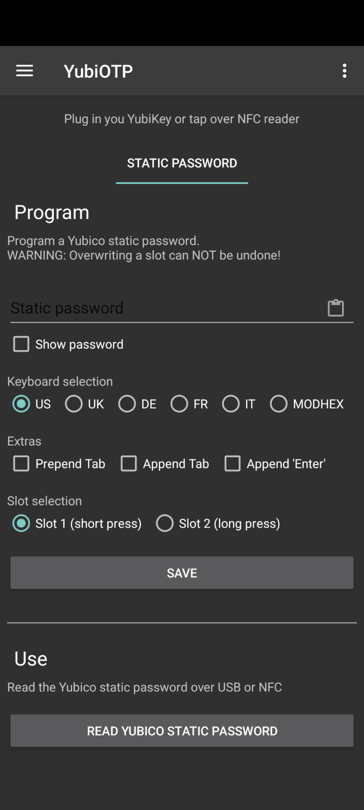
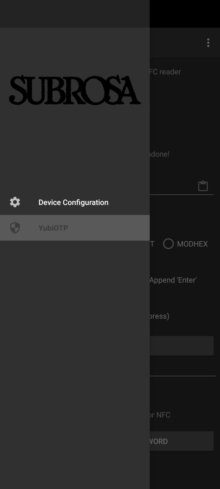
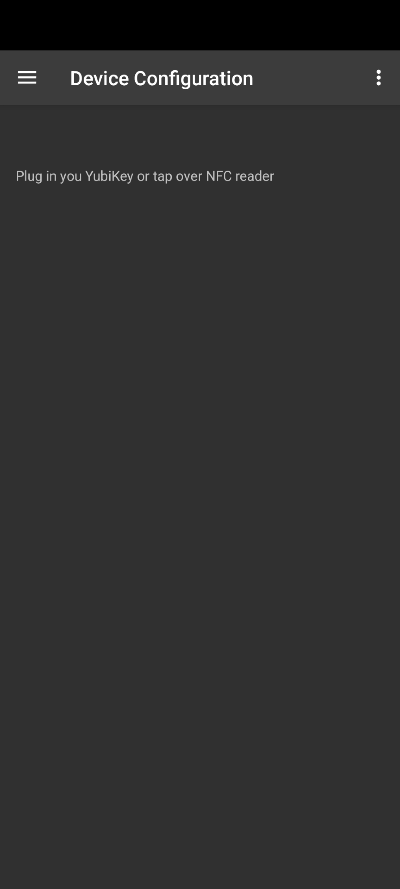
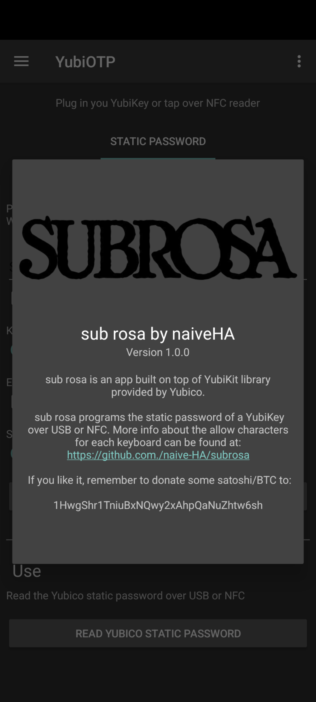

== sub rosa by naiveHA
Uncomplicated simple: if you manage your long, complicated and secure passwords in a password manager app (like KeePassDroid) on your Android device, you can now "type" them easily on any other device, be it a phone, tablet, or PC running Windows, Linux, or MacOS.

*sub rosa* allows you to program (over USB or NFC) the static password of your YubiKey which then can be used to "type" the password with the touch of a finger.

Once you are done "typing" your long, complicated and secure password, remember to wipe clean your YubiKey... Is not much security if anyone can "type" your password by touching the YubiKey!

*sub rosa* is an Android app, built on top of YubiKit library provided by Yubico,

*Keyboards*

The various keyboards accept the following characters:

*US*: space, \n, \t and abcdefghijklmnopqrstuvwxyzABCDEFGHIJKLMNOPQRSTUVWXYZ0123456789!"#$%&'`()*+-=,./:;<>?@[\]^_{}|~

*UK*: space, \n, \t and abcdefghijklmnopqrstuvwxyzABCDEFGHIJKLMNOPQRSTUVWXYZ0123456789!@£$%&'`()*+-=,./:;<>?"[#]^_{}~¬

*DE*: space, \n, \t and abcdefghijklmnopqrstuvwxyzABCDEFGHIJKLMNOPQRSTUVWXYZ0123456789!"#$%&'()*+-=,./:;<>?^_`§´ÄÖÜßäöü

*FR*: space, \n, \t and abcdefghijklmnopqrstuvwxyzABCDEFGHIJKLMNOPQRSTUVWXYZ0123456789!"$%&'()*+-=,./:;<_£§°²µàçèéù

*IT*: space, \n, \t and abcdefghijklmnopqrstuvwxyzABCDEFGHIJKLMNOPQRSTUVWXYZ0123456789!"#$%&'()*+,-./:;<=>?@\^_`|£§°çèéàìòù

*MODHEX*: bcdefghijklnrtuvBCDEFGHIJKLNRTUV

 &nbsp;  &nbsp;  &nbsp; 

Coffee tips can be sent to: 1HwgShr1TniuBxNQwy2xAhpQaNuZhtw6sh