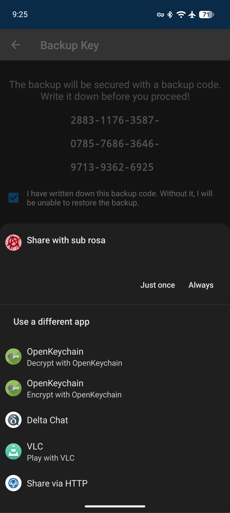
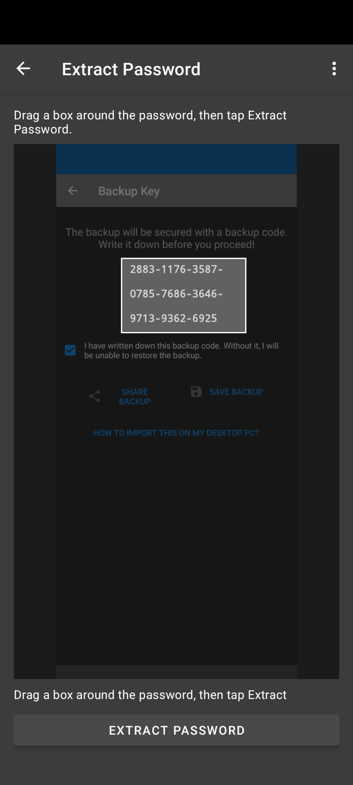
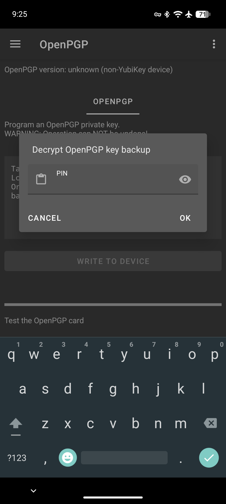
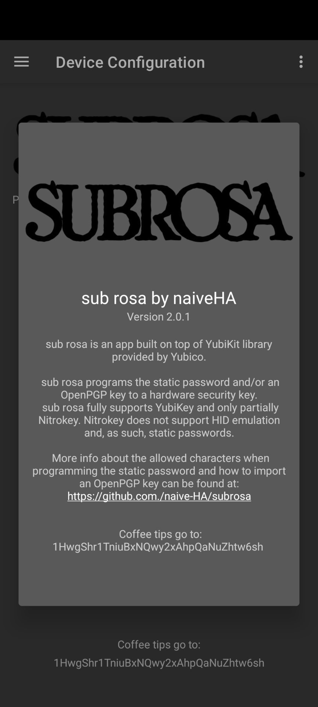
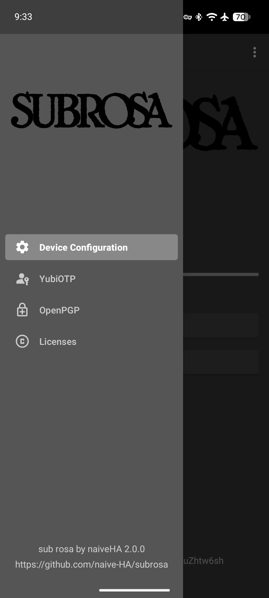
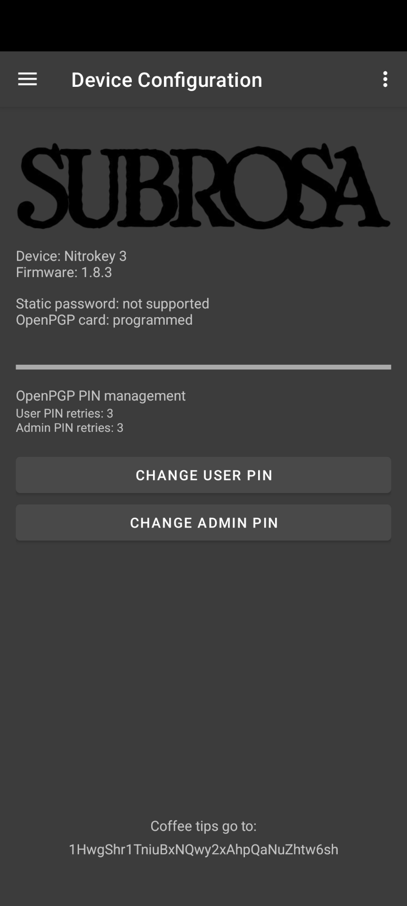
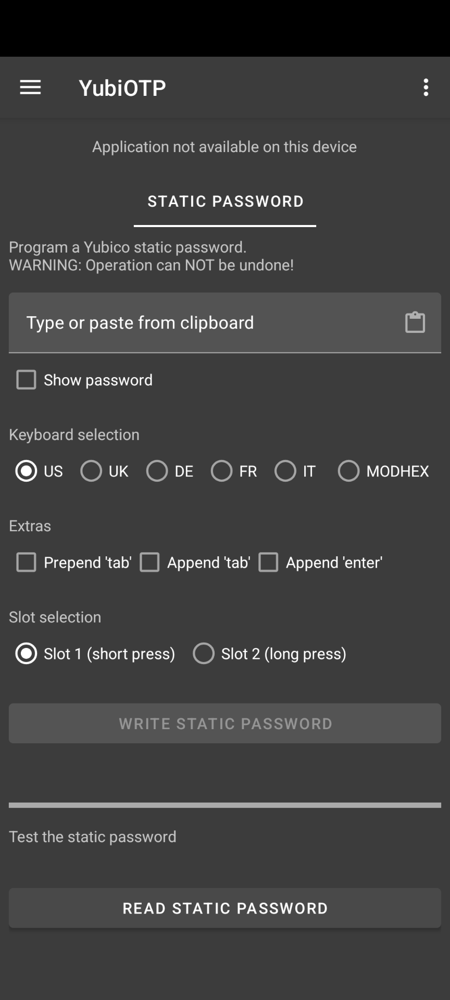
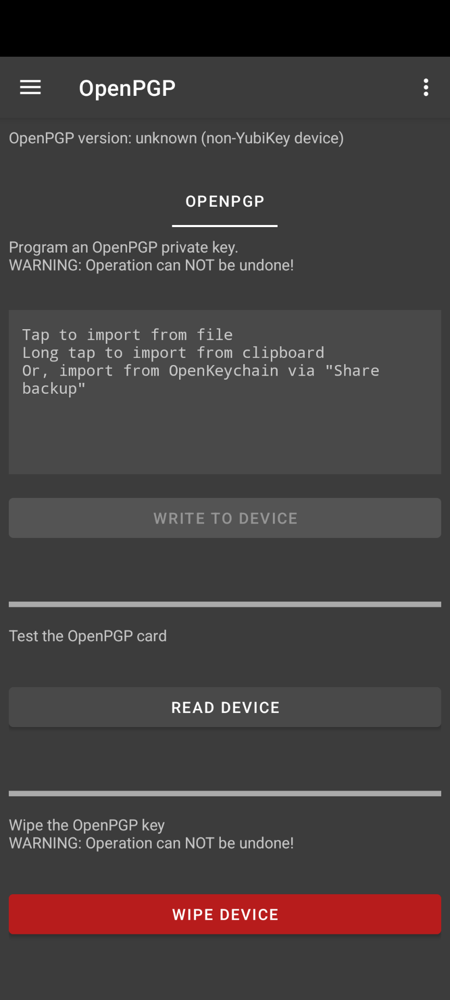
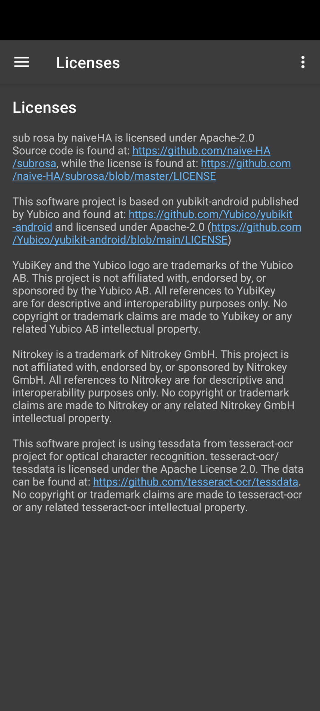

# sub rosa by naiveHA
Uncomplicatedly simple: if you manage your long, complicated and secure passwords in a password manager app (like KeePassDroid) on your Android device, 
you can now "type" them easily on any other device, be it a phone, tablet, or PC running Windows, Linux, or macOS.

*sub rosa* allows you to program the static password of your YubiKey which then can be used to "type" the password with the touch of a finger.

Once you are done "typing" your long, complicated and secure password, remember to wipe clean your YubiKey... 
It is not much security if anyone can "type" your password by touching the YubiKey!

The various keyboards accept the following characters:

* *US*: space, \n, \t and abcdefghijklmnopqrstuvwxyzABCDEFGHIJKLMNOPQRSTUVWXYZ0123456789!"#$%&'`()*+-=,./:;<>?@\\][^_{}|~

* *UK*: space, \n, \t and abcdefghijklmnopqrstuvwxyzABCDEFGHIJKLMNOPQRSTUVWXYZ0123456789!@£$%&'`()*+-=,./:;<>?"#][^_{}~¬

* *DE*: space, \n, \t and abcdefghijklmnopqrstuvwxyzABCDEFGHIJKLMNOPQRSTUVWXYZ0123456789!"#$%&'()*+-=,./:;<>?^_`§´ÄÖÜßäöü

* *FR*: space, \n, \t and abcdefghijklmnopqrstuvwxyzABCDEFGHIJKLMNOPQRSTUVWXYZ0123456789!"$%&'()*+-=,./:;<_£§°²µàçèéù

* *IT*: space, \n, \t and abcdefghijklmnopqrstuvwxyzABCDEFGHIJKLMNOPQRSTUVWXYZ0123456789!"#$%&'()*+,-./:;<=>?@\^_`|£§°çèéàìòù

* *MODHEX*: bcdefghijklnrtuvBCDEFGHIJKLNRTUV

Since version 2.0.0, sub rosa has added support for OpenPGP. You can now provision an OpenPGP key onto your YubiKey or Nitrokey 3. 
In keeping with the app’s motto, “Uncomplicatedly simple,” you can encrypt, decrypt, sign, and authenticate with your security key, 
then wipe it clean and write another OpenPGP key to change your digital identity. 
SSH authentication is simpler now—you no longer need to reuse the same SSH key or buy multiple security keys

# How to import OpenPGP keys from OpenKeychain
sub rosa works closely with OpenKeychain. OpenKeychain manages OpenPGP keys, such as generating, storing them securely, and backing them up. 
Importing from OpenKeychain is now a breeze. Share a key backup with Sub rosa and enter the backup code shown by OpenKeyring. 
For now, this backup code—made of 36 numbers and dashes—cannot be copied to the clipboard.
To make it “uncomplicatedly simple,” sub rosa includes Tesseract: an Optical Character Recognition library. 

Take a screenshot of the OpenKeyring app and share that screenshot with sub rosa.

Select the section that includes the backup code and hit the EXTRACT PASSWORD button. 

The backup code will be copied to the clipboard, and you can return to OpenKeyring and hit the SHARE BACKUP button.

Paste the backup code in Sub rosa and get ready to write your private OpenPGP key to your security key.

<table>
  <tr>
    <td></td>
    <td></td>
    <td></td>
  </tr>
</table>

NB: sub rosa is not affiliated with OpenKeychain.

# How to use your security key for SSH authentication
When generating a new OpenPGP key with OpenKeyring, choose *Change key configuration* and add an Authentication subkey. 
Then import this OpenPGP key into Sub Rosa and write it to your security key.

On a clean Debian machine, ensure all the right packages are installed:

    sudo apt update
    sudo apt install openssh-client gnupg scdaemon pinentry-curses pcscd

Identify where pinentry is installed:

    which pinentry

The output should be something like:

    /usr/bin/pinentry

Take note of that, then configure gpg-agent to enable SSH support and use that pinentry:

    echo "enable-ssh-support" > ~/.gnupg/gpg-agent.conf
    echo "pinentry-program /usr/bin/pinentry" >> ~/.gnupg/gpg-agent.conf

Restart the agent to pick up the config:

    gpgconf --kill gpg-agent
    gpgconf --launch gpg-agent
    gpgconf --list-dirs agent-ssh-socket

This should display something like:

    /run/user/1000/gnupg/S.gpg-agent.ssh

Take note of it and add it to your ~/.ssh/config:

    echo "Host *" > ~/.ssh/config
    echo "  IdentityAgent /run/user/1000/gnupg/S.gpg-agent.ssh" >> ~/.ssh/config

Make sure to replace /run/user/1000/gnupg/S.gpg-agent.ssh with the correct value for your own system.

Now interrogate the security key:

    gpg-connect-agent "scd learn --force" /bye

This displays details of the OpenPGP key written on your security key.
The output looks something like this:

    ...
    S KEYPAIRINFO ACD6963FB1576BFD6301E3C301DAE322834D8627 OPENPGP.1 sc 1782525877 rsa4096
    S KEYPAIRINFO F7172AFD4F68B5B1155DC06A371329E766D9AC29 OPENPGP.2 e 1782525877 rsa4096
    S KEYPAIRINFO 2D9D95B0606CB9D32FB364F83F325237FC2AEA8E OPENPGP.3 a 1782525877 rsa4096
    OK

To extract the SSH authentication key, run:

    echo "2D9D95B0606CB9D32FB364F83F325237FC2AEA8E" >> ~/.gnupg/sshcontrol
    gpgconf --kill gpg-agent
    export SSH_AUTH_SOCK=$(gpgconf --list-dirs agent-ssh-socket)
    ssh-add -L

Make sure to replace 2D9D95B0606CB9D32FB364F83F325237FC2AEA8E with the keygrip of your own Authentication subkey. 
The last command should display something like:

    ssh-ed25519 AAAAC3NzaC1lZDI1NTE5AAAAIGfZlzyF4mwdtAnUNJVz1TxOkotdHNizIaA56IOepfA/ cardno:25_547_078

Take note of that and add it to ~/.ssh/authorized_keys on your remote server.

When logging into your remote server via SSH, you'll be asked for a PIN. 
This is the User PIN (default 123456), not the Admin PIN (default 12345678).

NB: if the above instructions are not complete, open an issue and contribute to the project.

Coffee tips can be sent to: 1HwgShr1TniuBxNQwy2xAhpQaNuZhtw6sh

<table>
  <tr>
    <td></td>
    <td></td>
    <td></td>
  </tr>
  <tr>
    <td></td>
    <td></td>
    <td></td>
  </tr>
</table>

