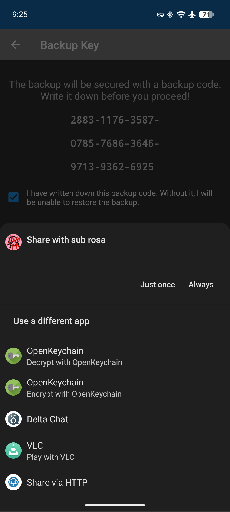
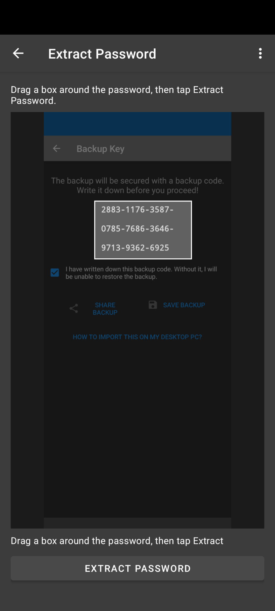
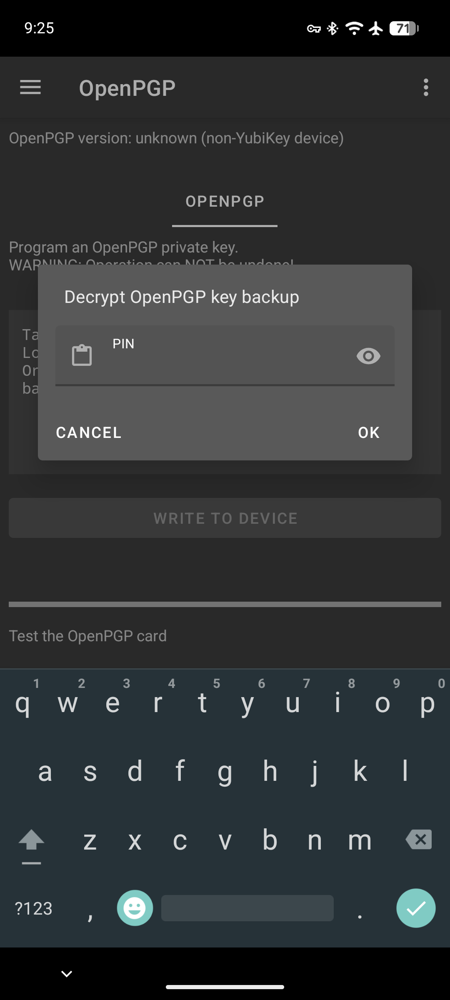
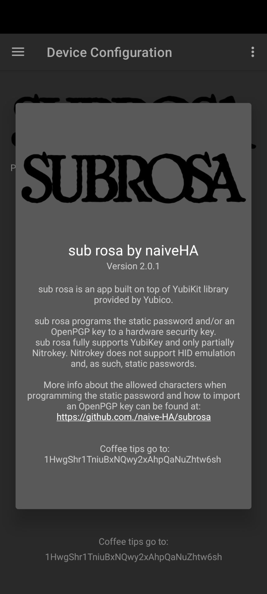
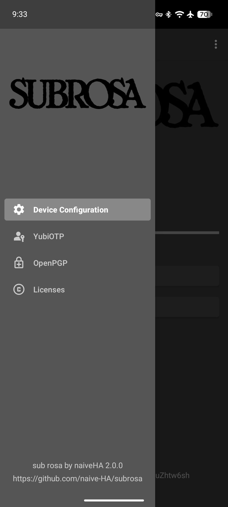
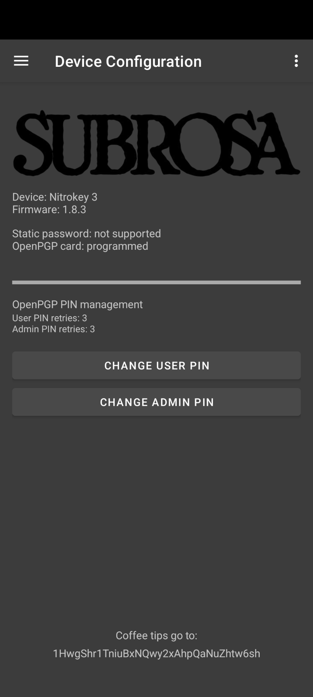
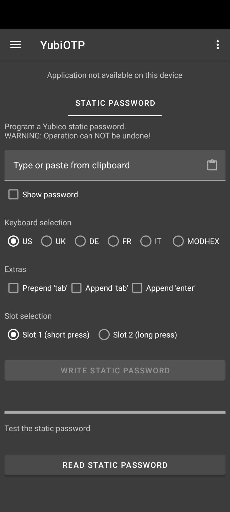
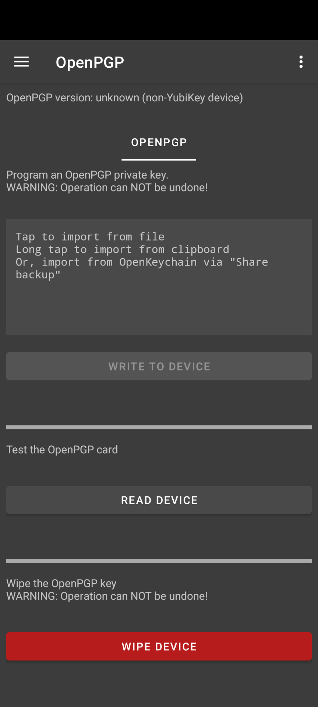
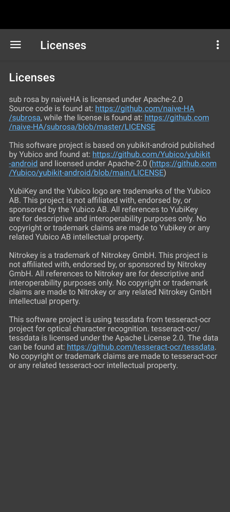

# sub rosa by naiveHA
"What does this app do?" Well, actually, the first question to be asked is "why?" Why is there a need for this app? The answer is "passwords".

We all have a "password problem". The IT industry is trying to solve the "password problem" for a long time.
Passwords are the weakest link in a digital security model. 

Life is complicated enough that you should not overload your mind with remembering long, complex passwords.
And on top of that, good hygene requires changing the password frequently. And then you have personal email, social media and banking accounts, etc. 
You should use unique passwords for each account such that when (when, not if) one account is compromised, the attacker does not gain access to all your accounts.
You get the point... I guess.

How many complex passwords (between 8 and 16 characters, including special characters like `~!@#$%^&*(){}:"<>?/.,';][=-) can you memorize?
One solution is to use a password manager app (like KeePassDroid) on your phone. 
But you use a work laptop, personal computer, tablet, maybe second phone... 
And the passwords still need to be changed for security purposes every now and then... 
How do stay safe online and still be able to log into your accounts on other devices when your passwords are on your mobile phone?
How do you type your passwords while enjoying a coffee at your local coffee shop, without worrying about surveillance cameras or shoulder surfing? 

Introducing "sub rosa". Uncomplicatedly simple.

sub rosa allows programming a static password to a YubiKey. YubiKey is a hardware device that can act as a keyboard when touched. Basically, you plug it in your phone, tablet, laptop and touch it and it types a sequence of characters.
Simple: no need to memorize multiple complex passwords. No need to have multiple such devices: you can program the YubiKey with a password, use it and then program it with another password. YubiKey comes in multiple form factors: from small enough that you can store it in the USB-C port of your phone, to larger and more capable (like NFC enabled)

sub rosa supports various keyboards capable of typing the following characters:

* *US*: space, \n, \t and abcdefghijklmnopqrstuvwxyzABCDEFGHIJKLMNOPQRSTUVWXYZ0123456789!"#$%&'`()*+-=,./:;<>?@\\][^_{}|~

* *UK*: space, \n, \t and abcdefghijklmnopqrstuvwxyzABCDEFGHIJKLMNOPQRSTUVWXYZ0123456789!@£$%&'`()*+-=,./:;<>?"#][^_{}~¬

* *DE*: space, \n, \t and abcdefghijklmnopqrstuvwxyzABCDEFGHIJKLMNOPQRSTUVWXYZ0123456789!"#$%&'()*+-=,./:;<>?^_`§´ÄÖÜßäöü

* *FR*: space, \n, \t and abcdefghijklmnopqrstuvwxyzABCDEFGHIJKLMNOPQRSTUVWXYZ0123456789!"$%&'()*+-=,./:;<_£§°²µàçèéù

* *IT*: space, \n, \t and abcdefghijklmnopqrstuvwxyzABCDEFGHIJKLMNOPQRSTUVWXYZ0123456789!"#$%&'()*+,-./:;<=>?@\^_`|£§°çèéàìòù

* *MODHEX*: bcdefghijklnrtuvBCDEFGHIJKLNRTUV

YubiKey solves one part of the "password problem": you do not need anymore to memorize passwords and you can log into your accounts over multiple devices while the password stays safe on your phone (protected with a PIN/passphrase/fingerprint)

But, if you lose the YubiKey, anyone can just touch it and it will sing your password like a canary... 
Not much security when anyone can touch your device and learn your last programmed password. 

No worries, sub rosa comes to help again: once you type your complex password with YubiKey, you can de-program the YubiKey device such that if you lose the device, 
you do not compromise your security. Simple.

YubiKey (and other similar products like Nitrokey, Librem key) can do more than just act as a keyboard.
sub rosa can program an OpenPGP key that you can use to encrypt, decrypt, cryptographically sign documents and even authenticate to remote servers via ssh.
An OpenPGP key is basically a digital identity.

Digital signatures are officially recognized in many countries and legally binding. 
But anything digital will get hacked at some point in time. Is not a question of if, but when.
So, just like with passwords, you should keep your digital personas compartmentalized.

sub rosa comes to help again: you can program an OpenPGP key to your YubiKey device, sign off an electronic document, 
and then program another OpenPGP key to decrypt a confidential message from a business partner or encrypt a whistleblower alert sent to a media organisation. 
And once you are done, you can simply erase everything off YubiKey such that if you lose your device, you are not compromising your digital personas.

# How does *sub rosa* support various hardware security keys?
<table>
	<tr>
		<td height="34"> </td>
		<td></td>
		<td>YubiKey</td>
		<td>YubiKey</td>
		<td>Nitrokey 3</td>
		<td>Nitrokey 3</td>
        <td>Nitrokey Pro</td>
        <td>Librem Key</td>
		</tr>
	<tr>
		<td></td>
		<td></td>
		<td >USB</td>
		<td>NFC</td>
		<td>USB</td>
		<td>NFC</td>
        <td>USB</td>
        <td>USB</td>
	</tr>
	<tr>
		<td>Static password</td>
		<td>Write</td>
		<td>✅</td>
		<td>✅</td>
		<td>❌</td>
		<td>❌</td>
        <td>❌</td>
        <td>❌</td>
	</tr>
	<tr>
		<td></td>
		<td>Read</td>
		<td>✅</td>
		<td>✅</td>
		<td>❌</td>
		<td>❌</td>
        <td>❌</td>
        <td>❌</td>
	</tr>
	<tr>
		<td></td>
		<td>Wipe</td>
		<td>✅</td>
		<td>✅</td>
		<td>❌</td>
		<td>❌</td>
        <td>❌</td>
        <td>❌</td>
	</tr>
	<tr>
		<td>OpenPGP</td>
		<td>Write</td>
		<td>✅</td>
		<td>✅</td>
		<td>✅</td>
		<td>❌</td>
        <td>✅</td>
        <td>✅</td>
	</tr>
	<tr>
		<td></td>
		<td>Read</td>
		<td>✅</td>
		<td>✅</td>
		<td>✅</td>
		<td>❌</td>
        <td>✅</td>
        <td>✅</td>
	</tr>
	<tr>
		<td></td>
		<td>Wipe</td>
		<td>✅</td>
		<td>✅</td>
		<td>✅</td>
		<td>❌</td>
        <td>✅</td>
        <td>✅</td>
	</tr>
	<tr>
		<td></td>
		<td>Change User PIN</td>
		<td>✅</td>
		<td>✅</td>
		<td>✅</td>
		<td>❌</td>
        <td>✅</td>
        <td>✅</td>
	</tr>
	<tr>
		<td></td>
		<td>Reset User PIN</td>
		<td>✅</td>
		<td>✅</td>
		<td>✅</td>
		<td>❌</td>
        <td>✅</td>
        <td>✅</td>
	</tr>
	<tr>
		<td></td>
		<td>Change Admin PIN</td>
		<td>✅</td>
		<td>✅</td>
		<td>✅</td>
		<td>❌</td>
        <td>✅</td>
        <td>✅</td>
	</tr>
</table>

<table>
	<colgroup width="115"></colgroup>
	<colgroup width="85"></colgroup>
	<colgroup width="132"></colgroup>
	<tr>
		<td height="34"> </td>
		<td></td>
		<td>YubiKey</td>
		<td>Nitrokey 3</td>
        <td>Nitrokey Pro</td>
        <td>Librem Key</td>
		</tr>
	<tr>
		<td>OpenKeychain supported algorithm</td>
		<td>RSA 2048</td>
		<td>✅</td>
		<td>✅</td>
		<td>✅</td>
		<td>✅</td>
	</tr>
	<tr>
		<td></td>
		<td>RSA 3072</td>
		<td>✅</td>
		<td>✅</td>
		<td>✅</td>
		<td>✅</td>
	</tr>
	<tr>
		<td></td>
		<td>RSA 4096</td>
		<td>✅</td>
		<td>✅</td>
		<td>✅</td>
		<td>✅</td>
	</tr>
	<tr>
		<td></td>
		<td>ECC NIST P-256</td>
		<td>✅</td>
		<td>✅</td>
		<td>✅</td>
		<td>✅</td>
	</tr>
	<tr>
		<td></td>
		<td>ECC NIST P-521</td>
		<td>✅</td>
		<td>✅</td>
		<td>✅</td>
		<td>✅</td>
	</tr>
	<tr>
		<td></td>
		<td>Ed25519/X25519</td>
		<td>✅</td>
		<td>✅</td>
		<td>❌</td>
		<td>❌</td>
	</tr>
</table>

Other algorithms have not been tested

# How to import OpenPGP keys from OpenKeychain
*sub rosa* works closely with OpenKeychain. OpenKeychain manages OpenPGP keys, such as generating, storing them securely, and backing them up. 
Importing from OpenKeychain is now a breeze. Share a key backup with *sub rosa* and enter the backup code shown by OpenKeyring. 
For now, this backup code—made of 36 numbers and dashes—cannot be copied to the clipboard.
To make it “uncomplicatedly simple,” *sub rosa* includes Tesseract, an Optical Character Recognition library. 

Take a screenshot of the OpenKeyring app and share that screenshot with *sub rosa*.

Select the section that includes the backup code and hit the EXTRACT PASSWORD button. 

The backup code will be copied to the clipboard, and you can return to OpenKeyring and hit the SHARE BACKUP button.

Paste the backup code in *sub rosa* and get ready to write your private OpenPGP key to your security key.

<table>
  <tr>
    <td></td>
    <td></td>
    <td></td>
  </tr>
</table>

NB: *sub rosa* is not affiliated with OpenKeychain, we are just big fans of OpenKeychain

# How to use your security key for SSH authentication
When generating a new OpenPGP key with OpenKeyring, choose *Change key configuration* and add an Authentication subkey. 
Then import this OpenPGP key into *sub rosa* and write it to your security key.

On a clean Debian machine, ensure all the right packages are installed:

    sudo apt update
    sudo apt install openssh-client gnupg scdaemon pinentry-curses pcscd

Identify where pinentry is installed:

    which pinentry

The output should be something like:

    /usr/bin/pinentry

Take note of that, then configure gpg-agent to enable SSH support and use that pinentry:

    echo "enable-ssh-support" > ~/.gnupg/gpg-agent.conf
    echo "pinentry-program /usr/bin/pinentry" >> ~/.gnupg/gpg-agent.conf

Restart the agent to pick up the config:

    gpgconf --kill gpg-agent
    gpgconf --launch gpg-agent
    gpgconf --list-dirs agent-ssh-socket

This should display something like:

    /run/user/1000/gnupg/S.gpg-agent.ssh

Take note of it and add it to your ~/.ssh/config:

    echo "Host *" > ~/.ssh/config
    echo "  IdentityAgent /run/user/1000/gnupg/S.gpg-agent.ssh" >> ~/.ssh/config

Make sure to replace /run/user/1000/gnupg/S.gpg-agent.ssh with the correct value for your own system.

Now interrogate the security key:

    gpg-connect-agent "scd learn --force" /bye

This displays details of the OpenPGP key written on your security key.
The output looks something like this:

    ...
    S KEYPAIRINFO 5BBF795A5F93498C2FF6C6CD3ABF896302DC9FA0 OPENPGP.1 sc 1782525925 ed25519
    S KEYPAIRINFO D1B359A6A77A68B1776ABFA085E65AFA1582E6D6 OPENPGP.2 e 1782525925 cv25519
    S KEYPAIRINFO 36F40BE75662CEA929402AAA360A64F448E35ABB OPENPGP.3 a 1782525925 ed25519
    OK

To extract the SSH authentication key, run:

    echo "36F40BE75662CEA929402AAA360A64F448E35ABB" >> ~/.gnupg/sshcontrol
    gpgconf --kill gpg-agent
    export SSH_AUTH_SOCK=$(gpgconf --list-dirs agent-ssh-socket)
    ssh-add -L

Make sure to replace 36F40BE75662CEA929402AAA360A64F448E35ABB with the keygrip of your own Authentication subkey. 
The last command should display something like:

    ssh-ed25519 AAAAC3NzaC1lZDI1NTE5AAAAIGfZlzyF4mwdtAnUNJVz1TxOkotdHNizIaA56IOepfA/ cardno:000F_D52FD320

Take note of that and add it to ~/.ssh/authorized_keys on your remote server.

When logging into your remote server via SSH, you'll be asked for a PIN. 
This is the User PIN (default 123456), not the Admin PIN (default 12345678).

NB: if the above instructions are not complete, open an issue and contribute to the project.

Coffee tips can be sent to: 1HwgShr1TniuBxNQwy2xAhpQaNuZhtw6sh

<table>
  <tr>
    <td></td>
    <td></td>
    <td></td>
  </tr>
  <tr>
    <td></td>
    <td></td>
    <td></td>
  </tr>
</table>

